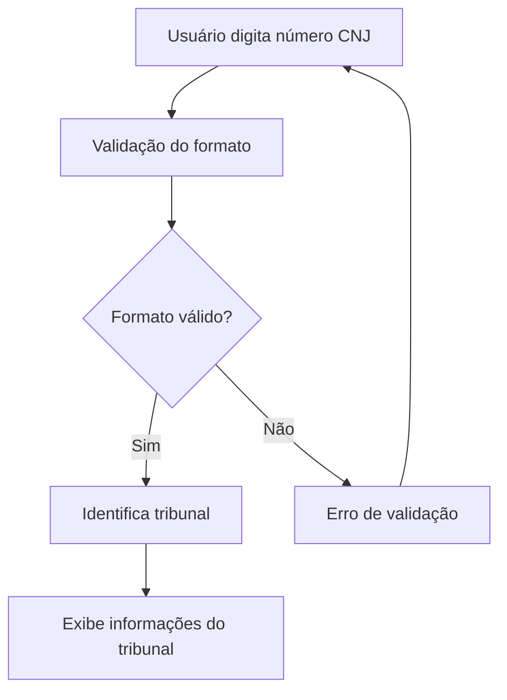
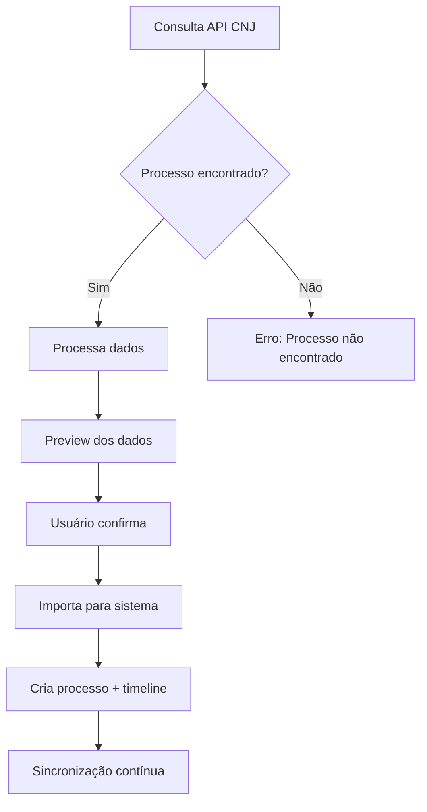
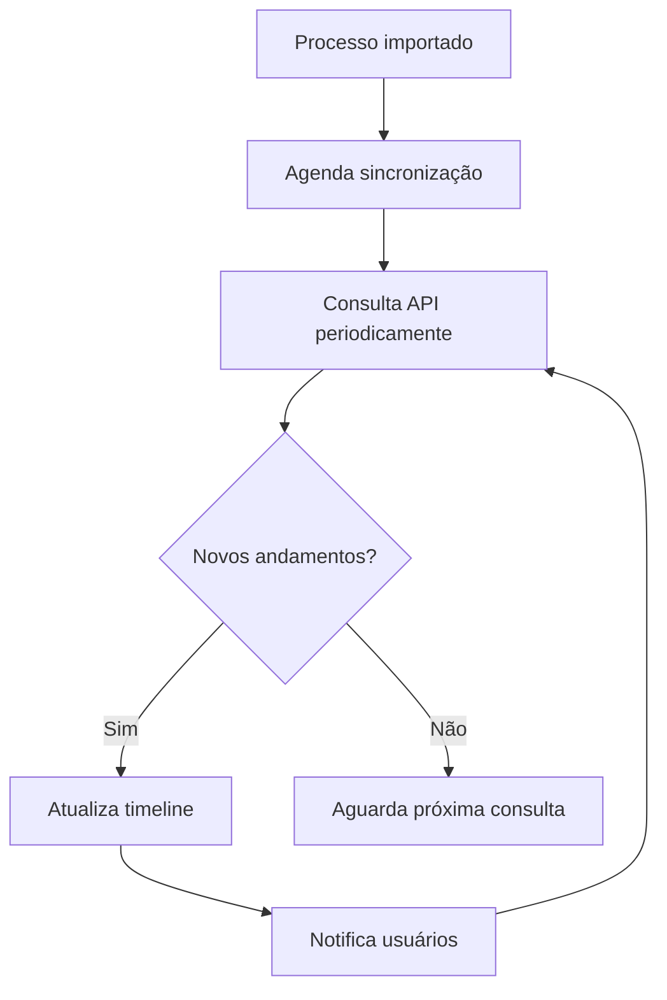

# 🔗 Integração com API Oficial do CNJ (DataJud)

## 🎯 Visão Geral

Esta integração permite que o sistema se conecte diretamente com a **API oficial do CNJ (DataJud)** para importar e sincronizar dados de processos automaticamente.

### **🚀 Benefícios Principais**

- ✅ **Dados Oficiais**: Informações diretas dos tribunais
- ✅ **Automação Completa**: Importação automática de processos
- ✅ **Timeline Real**: Andamentos atualizados em tempo real
- ✅ **Documentos Oficiais**: Acesso a petições e sentenças
- ✅ **Prazos Precisos**: Prazos legais corretos
- ✅ **Sincronização Contínua**: Atualizações automáticas

## 🔧 Arquitetura da Integração

### **1. Serviço de Integração CNJ**
```
backend/core/services/cnj_integration.py
```

**Funcionalidades:**
- Consulta à API DataJud
- Processamento de dados
- Criação automática de processos
- Sincronização contínua
- Classificação inteligente de andamentos

### **2. Endpoints da API**
```
backend/apps/processes/cnj_routes.py
```

**Endpoints disponíveis:**
- `POST /cnj/consultar/{numero_cnj}` - Consulta processo
- `POST /cnj/importar/{numero_cnj}` - Importa processo
- `PUT /cnj/sincronizar/{process_id}` - Sincroniza processo
- `GET /cnj/status/{numero_cnj}` - Verifica status
- `POST /cnj/validar-cnj/{numero_cnj}` - Valida número CNJ

### **3. Interface Frontend**
```
saas-juridico-frontend/src/components/CNJImportModal.tsx
```

**Funcionalidades:**
- Validação de número CNJ
- Preview dos dados
- Importação em etapas
- Feedback visual

## 📊 Fluxo de Integração

### **1. Validação do Número CNJ**


### **2. Consulta e Importação**


### **3. Sincronização Contínua**


## 🔍 Funcionalidades Detalhadas

### **1. Validação Inteligente**
- ✅ **Formato CNJ**: Valida estrutura de 20 dígitos
- ✅ **Tribunal**: Identifica tribunal automaticamente
- ✅ **Componentes**: Extrai sequencial, ano, vara, etc.
- ✅ **Formatação**: Exibe número formatado

### **2. Consulta Completa**
- ✅ **Dados Básicos**: Assunto, classe, tribunal
- ✅ **Partes**: Autor, réu, terceiros
- ✅ **Andamentos**: Timeline completa
- ✅ **Documentos**: Petições, sentenças
- ✅ **Valores**: Valor da causa, custas

### **3. Importação Automática**
- ✅ **Processo**: Cria processo automaticamente
- ✅ **Cliente**: Extrai dados das partes
- ✅ **Timeline**: Importa todos os andamentos
- ✅ **Classificação**: IA classifica andamentos
- ✅ **Documentos**: Links para documentos oficiais

### **4. Sincronização Contínua**
- ✅ **Background**: Atualizações automáticas
- ✅ **Novos Andamentos**: Detecta mudanças
- ✅ **Notificações**: Alerta sobre atualizações
- ✅ **Histórico**: Mantém histórico completo

## 🛠️ Implementação Técnica

### **1. Mapeamento de Tribunais**
```python
TRIBUNAIS_MAPA = {
    # Justiça Estadual (TJ)
    '8.01': 'tjac',   # Acre
    '8.02': 'tjal',   # Alagoas
    '8.26': 'tjsp',   # São Paulo
    # ... todos os tribunais
}
```

### **2. Processamento de Dados**
```python
def processar_dados_processo(self, dados_cnj: Dict[str, Any]) -> Dict[str, Any]:
    # Extrai dados básicos
    # Processa partes
    # Organiza andamentos
    # Classifica documentos
    return dados_processados
```

### **3. Classificação Inteligente**
```python
def _classificar_andamento(self, descricao: str) -> str:
    # IA para classificar andamentos
    # sentença, audiência, petição, despacho, prazo
    return classificacao
```

## 📱 Interface do Usuário

### **1. Modal de Importação**
- **Step 1**: Input do número CNJ
- **Step 2**: Validação e identificação do tribunal
- **Step 3**: Preview dos dados do processo
- **Step 4**: Confirmação e importação

### **2. Validação Visual**
- ✅ **Formato Correto**: Número formatado
- ✅ **Tribunal Identificado**: Nome do tribunal
- ✅ **Componentes**: Sequencial, ano, vara
- ✅ **Status**: Válido/inválido

### **3. Preview dos Dados**
- 📋 **Informações Básicas**: Assunto, classe, tribunal
- 👥 **Partes**: Autor, réu, terceiros
- 📅 **Andamentos**: Últimos movimentos
- 💰 **Valores**: Valor da causa
- 📄 **Documentos**: Links para petições

## 🔒 Segurança e Limites

### **1. Rate Limiting**
- ✅ **Limite de Consultas**: Evita sobrecarga da API
- ✅ **Cache Inteligente**: Reduz consultas desnecessárias
- ✅ **Retry Logic**: Tratamento de falhas

### **2. Validação de Dados**
- ✅ **Sanitização**: Remove dados maliciosos
- ✅ **Validação**: Verifica integridade dos dados
- ✅ **Logs**: Registra todas as operações

### **3. Permissões**
- ✅ **Controle de Acesso**: Apenas usuários autorizados
- ✅ **Auditoria**: Log de todas as importações
- ✅ **Isolamento**: Dados por tenant

## 📊 Monitoramento

### **1. Métricas**
- 📈 **Taxa de Sucesso**: % de importações bem-sucedidas
- ⏱️ **Tempo de Resposta**: Performance da API
- 🔄 **Sincronizações**: Frequência de atualizações
- 📊 **Processos Importados**: Total por período

### **2. Logs**
- 🔍 **Consultas**: Todas as consultas à API
- ⚠️ **Erros**: Falhas e exceções
- ✅ **Sucessos**: Importações bem-sucedidas
- 🔄 **Sincronizações**: Atualizações automáticas

### **3. Alertas**
- 🚨 **API Indisponível**: Quando DataJud está fora
- ⚠️ **Rate Limit**: Quando limite é atingido
- 🔄 **Falhas de Sincronização**: Quando não consegue atualizar

## 🚀 Próximas Melhorias

### **1. Funcionalidades Avançadas**
- 🔄 **Sincronização em Tempo Real**: Webhooks da API
- 🤖 **IA Avançada**: Análise de sentenças
- 📊 **Análise Preditiva**: Probabilidade de sucesso
- 🔗 **Integração com PJe**: Para tribunais específicos

### **2. Otimizações**
- ⚡ **Cache Inteligente**: Reduz consultas
- 🔄 **Sincronização Incremental**: Apenas mudanças
- 📱 **Notificações Push**: Alertas em tempo real
- 📊 **Dashboard**: Métricas de integração

### **3. Expansão**
- 🌐 **Mais Tribunais**: Cobertura nacional
- 📄 **Documentos**: Download automático
- 🔍 **Busca Avançada**: Por múltiplos critérios
- 📈 **Relatórios**: Análises estatísticas

## 📋 Como Usar

### **1. Importar Processo**
1. Acesse a página de processos
2. Clique em "Importar do CNJ"
3. Digite o número CNJ
4. Valide o formato
5. Visualize os dados
6. Confirme a importação

### **2. Sincronizar Processo**
1. Acesse o processo importado
2. Clique em "Sincronizar com CNJ"
3. Aguarde a atualização
4. Visualize novos andamentos

### **3. Monitorar Atualizações**
1. Configure notificações
2. Acompanhe timeline
3. Receba alertas de prazos
4. Visualize documentos

## 🎯 Resultados Esperados

### **1. Produtividade**
- ⚡ **90% mais rápido**: Importação automática
- 📊 **100% preciso**: Dados oficiais
- 🔄 **Atualização contínua**: Sem intervenção manual
- 📱 **Acesso móvel**: Consulta em qualquer lugar

### **2. Qualidade**
- ✅ **Dados confiáveis**: Fonte oficial
- 📅 **Prazos corretos**: Informações precisas
- 📄 **Documentos completos**: Acesso total
- 🔍 **Histórico completo**: Timeline detalhada

### **3. Experiência**
- 🎯 **Interface intuitiva**: Fácil de usar
- ⚡ **Resposta rápida**: Performance otimizada
- 📱 **Responsivo**: Funciona em todos os dispositivos
- 🔔 **Notificações**: Alertas inteligentes

**🎉 Integração completa com API CNJ implementada e pronta para uso!**
