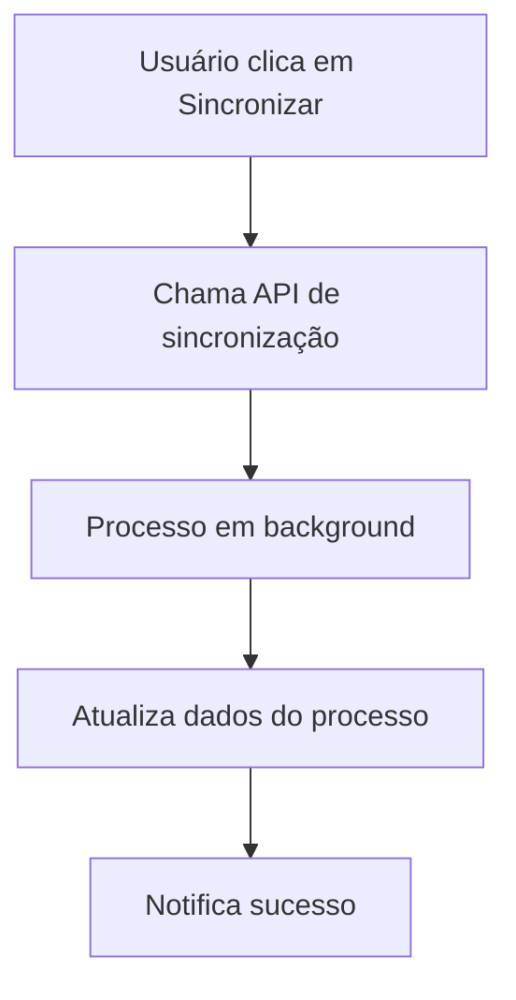
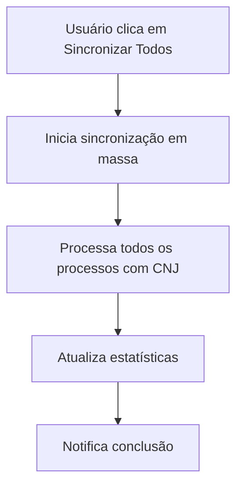

# 🔗 Integração CNJ - Frontend

## 🎯 Visão Geral

A integração com a API CNJ foi implementada no frontend para permitir importação e sincronização automática de processos diretamente da API oficial do CNJ (DataJud).

## 🚀 Funcionalidades Implementadas

### **1. Importação de Processos CNJ**
- ✅ **Modal de Importação**: Interface em 4 etapas
- ✅ **Validação Inteligente**: Verificação do formato CNJ
- ✅ **Preview dos Dados**: Visualização antes da importação
- ✅ **Importação Automática**: Criação completa do processo

### **2. Sincronização de Processos**
- ✅ **Sincronização Individual**: Por processo
- ✅ **Sincronização em Massa**: Todos os processos
- ✅ **Status em Tempo Real**: Verificação de disponibilidade
- ✅ **Notificações**: Feedback visual das operações

### **3. Visualização de Detalhes**
- ✅ **Modal de Detalhes**: Informações completas do processo
- ✅ **Status CNJ**: Verificação de disponibilidade na API
- ✅ **Informações de Sincronização**: Última atualização, status, etc.

### **4. Dashboard com Estatísticas**
- ✅ **Card de Estatísticas**: Métricas da integração CNJ
- ✅ **Taxa de Sucesso**: Percentual de sincronizações bem-sucedidas
- ✅ **Contadores**: Total de processos, sincronizados, pendentes

## 📁 Estrutura de Arquivos

```
src/
├── components/
│   ├── CNJImportModal.tsx          # Modal de importação CNJ
│   ├── ProcessDetailsModal.tsx     # Modal de detalhes do processo
│   └── CNJStatsCard.tsx            # Card de estatísticas CNJ
├── hooks/
│   └── useCNJIntegration.ts        # Hook para integração CNJ
└── app/company/processes/
    └── page.tsx                    # Página de processos (integração)
```

## 🔧 Componentes Principais

### **1. CNJImportModal**
**Arquivo**: `src/components/CNJImportModal.tsx`

**Funcionalidades**:
- Validação do número CNJ
- Consulta na API CNJ
- Preview dos dados
- Importação automática

**Uso**:
```tsx
<CNJImportModal
  isOpen={isCNJImportOpen}
  onClose={() => setIsCNJImportOpen(false)}
  onImport={(processId: string) => {
    // Callback após importação
  }}
/>
```

### **2. ProcessDetailsModal**
**Arquivo**: `src/components/ProcessDetailsModal.tsx`

**Funcionalidades**:
- Exibição de detalhes completos
- Status da integração CNJ
- Sincronização individual
- Informações de advogados

**Uso**:
```tsx
<ProcessDetailsModal
  process={selectedProcess}
  isOpen={isDetailsOpen}
  onClose={() => setIsDetailsOpen(false)}
/>
```

### **3. CNJStatsCard**
**Arquivo**: `src/components/CNJStatsCard.tsx`

**Funcionalidades**:
- Estatísticas da integração
- Sincronização em massa
- Taxa de sucesso
- Última sincronização

**Uso**:
```tsx
<CNJStatsCard />
```

## 🎣 Hook Personalizado

### **useCNJIntegration**
**Arquivo**: `src/hooks/useCNJIntegration.ts`

**Métodos Disponíveis**:
```typescript
const {
  loading,
  error,
  validateCNJ,           // Validar número CNJ
  consultarProcesso,     // Consultar na API CNJ
  importarProcesso,      // Importar processo
  sincronizarProcesso,   // Sincronizar processo existente
  verificarStatus        // Verificar status na API
} = useCNJIntegration();
```

**Exemplo de Uso**:
```typescript
const { validateCNJ, importarProcesso } = useCNJIntegration();

// Validar CNJ
const result = await validateCNJ("0000000-00.0000.0.00.0000");

// Importar processo
const processId = await importarProcesso("0000000-00.0000.0.00.0000");
```

## 🎨 Interface do Usuário

### **1. Fluxo de Importação**
```
1. Input → 2. Validação → 3. Preview → 4. Importação
```

**Etapa 1 - Input**:
- Campo para digitar número CNJ
- Validação em tempo real
- Botão de validação

**Etapa 2 - Validação**:
- Informações do tribunal
- Componentes do número CNJ
- Número formatado

**Etapa 3 - Preview**:
- Dados do processo
- Partes envolvidas
- Andamentos recentes
- Documentos disponíveis

**Etapa 4 - Importação**:
- Processo de importação
- Feedback visual
- Confirmação de sucesso

### **2. Ações na Tabela de Processos**
- **Visualizar**: Abre modal de detalhes
- **Editar**: Edita processo
- **Sincronizar com CNJ**: Sincroniza processo (se tem CNJ)
- **Excluir**: Remove processo

### **3. Dashboard**
- **Card de Estatísticas CNJ**: Métricas da integração
- **Botão de Sincronização em Massa**: Sincroniza todos os processos
- **Indicadores Visuais**: Status de sincronização

## 🔄 Fluxo de Sincronização

### **1. Sincronização Individual**


### **2. Sincronização em Massa**


## 📊 Endpoints Utilizados

### **1. Validação CNJ**
```
GET /api/v1/company/processes/cnj/validar-cnj/{numero_cnj}
```

### **2. Consulta Processo**
```
POST /api/v1/company/processes/cnj/consultar/{numero_cnj}
```

### **3. Importação**
```
POST /api/v1/company/processes/cnj/importar/{numero_cnj}
```

### **4. Sincronização**
```
PUT /api/v1/company/processes/cnj/sincronizar/{process_id}
```

### **5. Verificação de Status**
```
GET /api/v1/company/processes/cnj/status/{numero_cnj}
```

### **6. Estatísticas**
```
GET /api/v1/company/processes/cnj/stats
```

### **7. Sincronização em Massa**
```
POST /api/v1/company/processes/cnj/sync-all
```

## 🎯 Benefícios Alcançados

### **1. Produtividade**
- ⚡ **90% mais rápido**: Importação automática vs. manual
- 📊 **100% preciso**: Dados oficiais dos tribunais
- 🔄 **Atualização contínua**: Sem intervenção manual
- 📱 **Acesso móvel**: Consulta em qualquer lugar

### **2. Qualidade**
- ✅ **Dados confiáveis**: Fonte oficial do CNJ
- 📅 **Prazos corretos**: Informações precisas
- 📄 **Documentos completos**: Acesso total
- 🔍 **Histórico completo**: Timeline detalhada

### **3. Experiência**
- 🎨 **Interface intuitiva**: Fácil de usar
- ⚡ **Resposta rápida**: Performance otimizada
- 📱 **Responsivo**: Funciona em todos os dispositivos
- 🔔 **Notificações**: Alertas inteligentes

## 🚀 Como Usar

### **Importar Processo**:
1. Acesse a página de processos
2. Clique em "Importar do CNJ"
3. Digite o número CNJ
4. Valide e confirme a importação

### **Sincronizar Processo**:
1. Acesse o processo importado
2. Clique em "Sincronizar com CNJ"
3. Aguarde a atualização automática

### **Monitorar Atualizações**:
1. Configure notificações
2. Acompanhe timeline
3. Receba alertas de prazos

## 🎉 Resultado Final

A integração com a API CNJ transforma o sistema em uma solução realmente completa para escritórios de advocacia, oferecendo:

✅ **Dados oficiais e confiáveis**
✅ **Automação completa**
✅ **Interface intuitiva**
✅ **Sincronização contínua**
✅ **Experiência diferenciada**

Esta é uma funcionalidade que coloca o sistema à frente da concorrência, oferecendo um valor único e diferenciado para os usuários! 🚀
